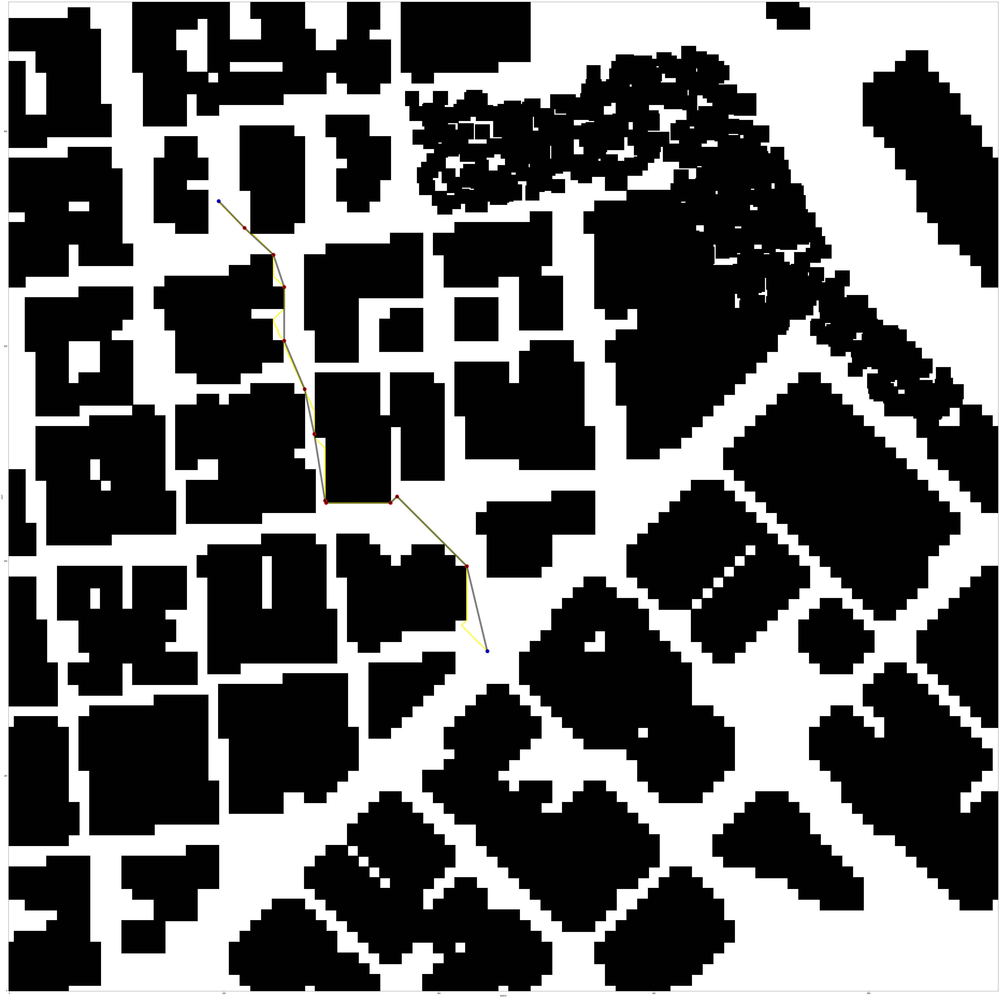

## Project: 3D Motion Planning

---

# Overview
This project aims to simulate a mission of a drone in an urban environment. The steps undertaken to achieve this are follows:
1. Load the 2.5D map in the colliders.csv file describing the environment.
2. Discretize the environment into a grid or graph representation.
3. Define the start and goal locations.
4. Perform a search using A* or other search algorithm.
5. Use a collinearity test or ray tracing method (like Bresenham) to remove unnecessary waypoints.
6. Return waypoints in local ECEF coordinates (format for `self.all_waypoints` is [N, E, altitude, heading], where the drone’s start location corresponds to [0, 0, 0, 0].

### The Starter Code
This project is forked from [FCND-Motion-Planning](https://github.com/udacity/FCND-Motion-Planning) project. This project completes the partial implementation of its fork.

#### Functionality of `motion_planning.py` and `planning_utils.py`
The `motion_planning.py` contains the main class `MotionPlanning` of the script that communicates with the simulator and starts the execution.
`MotionPlanning` is a finite state machine containing all the callback methods `local_position_callback`, `velocity_callback` and `state_callback` which are executed when the position, velocity or the state change respectively.
The `state_callback` handles which state transition to make and calls the appropriate method. 

There is a special method `plan_path` which houses the implementation required to perform steps 1. to 6. stated above.
A lot of this functionality has been defined in `planning_utils.py` like the implementation of A* search, bresenham ray-tracing, etc. Additionally, there are `general_utils.py` and `constants.py` files that facilitate declaration of general utils or common data used by the main two files.

### The Simulation environment
Here is a lovely picture of downtown San Francisco environment from above:

And here is the equivalent view of the simulation environment from above:

### The Path Planning Algorithm

#### 1. Set global home position
Read the first line of the csv file using `general_utils.read_line_from_file`, parse the line to extract lat0 and lon0 values and convert them to float in `general_utils.parse_lat_lon_alt()`. Use `self.set_home_position()` method to set global home.

#### 2. Set current local position
Use `global_to_local()` to get northing, easting values from longitude and latitude coordinates.

#### 3. Set grid start position from local position
Use `planning_utils.relative_grid_pose()` to offset the starting position in the grid correctly.

#### 4. Set grid goal position from geodetic coords
Use `planning_utils.get_grid_goal()` to get a far, medium or nearby value in the grid.

#### 5. Search algorithm
Implement the search algorithm to model produce a naive path on the grid cells.

#### 6. Cull waypoints 
Use the `planning_utils.prune_path()` method implementing the Bresenham ray-tracing algorithm to remove unnecessary waypoints from the naive path.

### Results
Key:
- Blue points are start and goal nodes.
- Yellow points are waypoints generated by the search algorithm.
- Red points are waypoints after pruning by Bresenham's ray-tracing algorithm.
- Black lines make up the paths connecting the waypoints.

#### Planning a medium distance route:

#### Planning a long distance route:

### Demo simulation run

## Tasks

- [x] Implement with A*.
- [ ] Implement with D* Lite.
- [x] Implement with RTT.
- [ ] Implement with Probabilistic Roadmap.
- [ ] Implement as a Markov Decision Process Problem.
